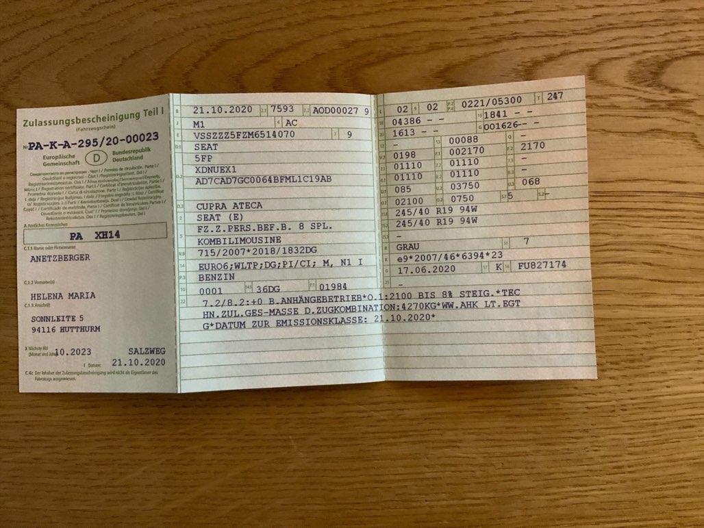
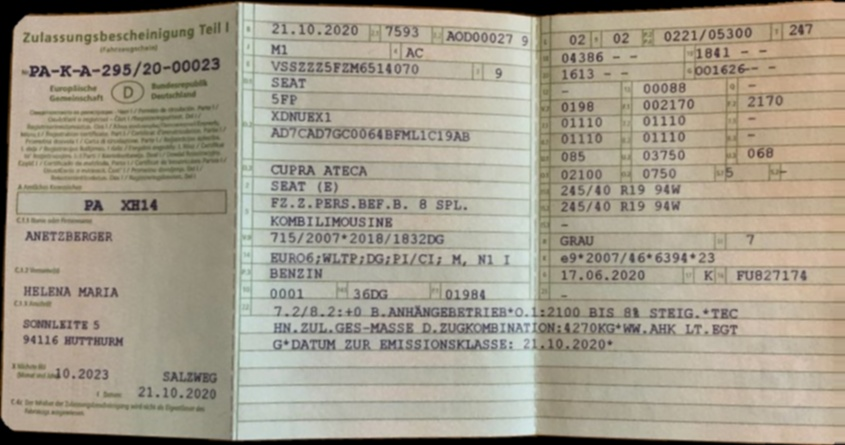
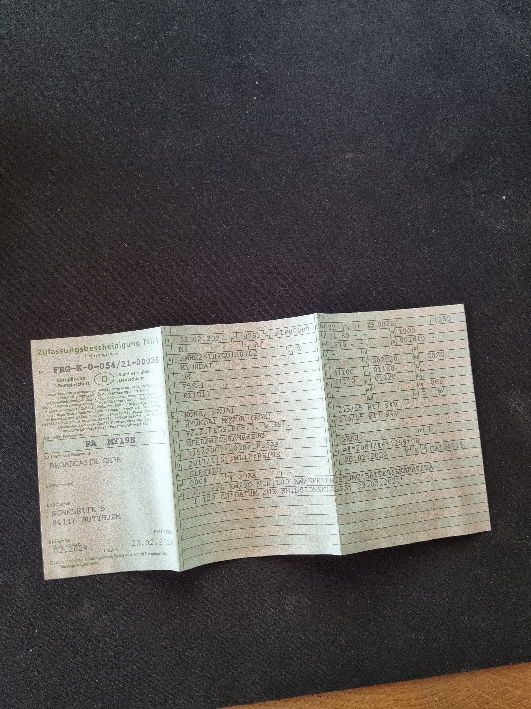
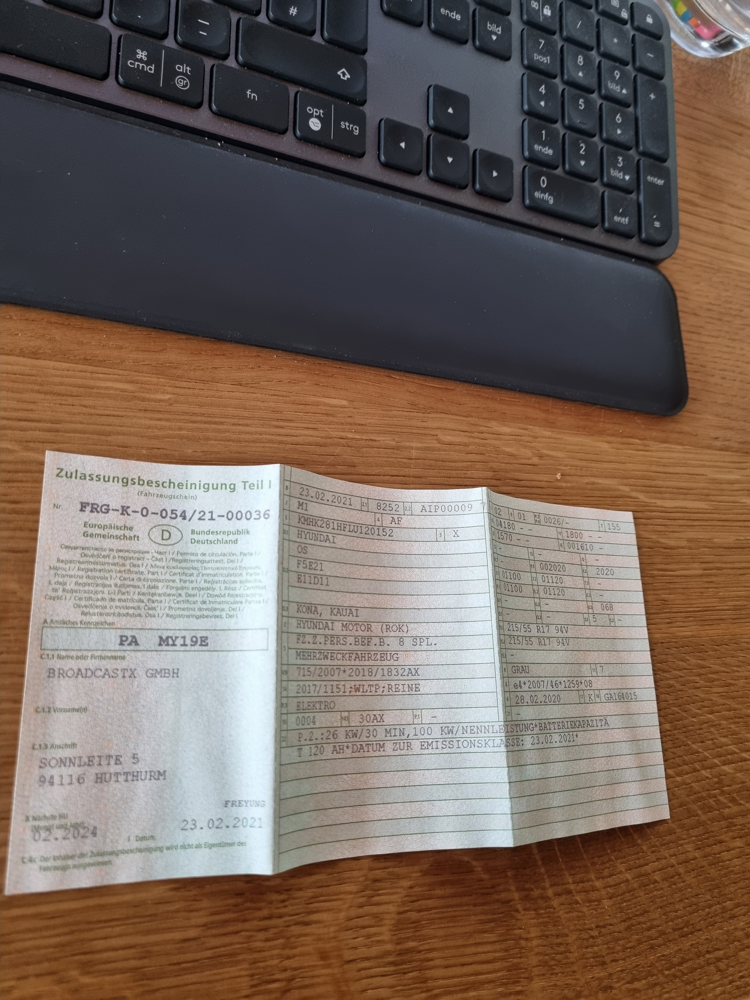
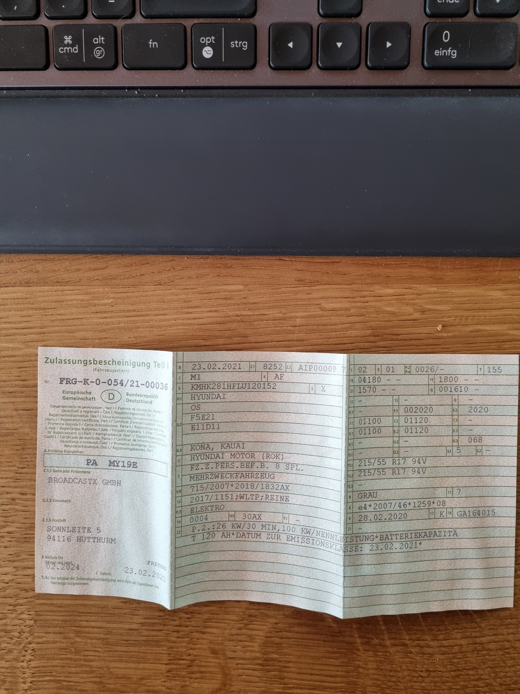
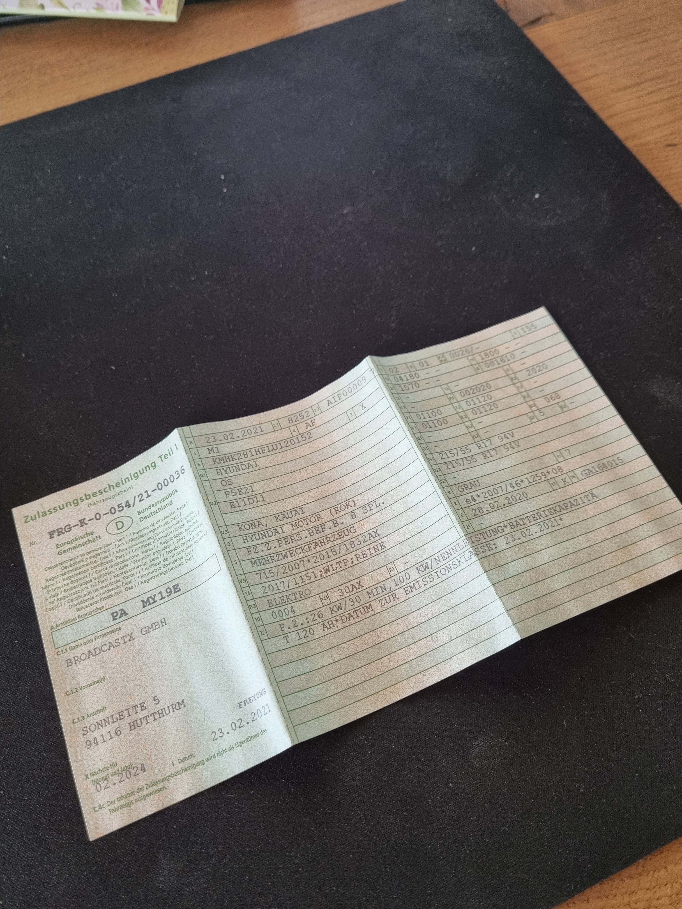
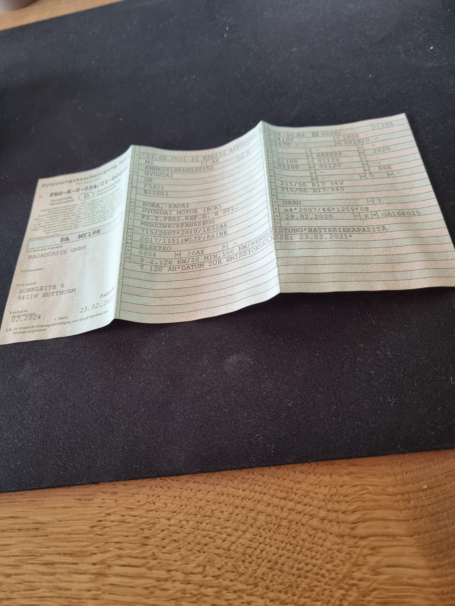

# Document_Segmentation
Segment a document from an image and perform image processing.

# Run program

## Requirements
1. install python 3.8.10
2. install opencv
```shell
pip install opencv-contrib-python
```
3. install matplotlib
```shell
pip install matplotlib
```

## Commands to run program
```shell
python3 source/main.py --input="original image path" --output="result image path"
```

### Results
| origin | result |
| ------ | ------ |
|  |  |
|  |  |
|  |  |
|  |  |
|  |  |
|  |  |